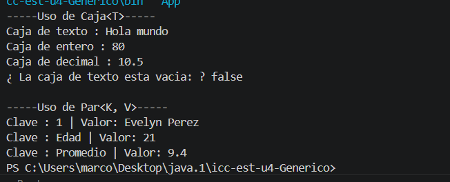

# Práctica: Clases Genéricas en Java

## Datos del Estudiante
- **Nombre:** kevin sacaquirin
- **Curso:** grupo 1
- **Fecha:** 6 de junio 2026

---

## 1. Implementación de Caja<T> y Par<K, V>

**Fecha:** 6 de junio de 2026 
**Descripción:** En esta práctica se implementaron las clases genéricas Caja<T> y Par<K, V> dentro del paquete models. La clase Caja<T> permite almacenar y obtener un dato de cualquier tipo, mientras que la clase Par<K, V> permite representar una relación entre una clave y un valor. En la captura se muestra la ejecución del programa en consola con diferentes tipos de datos.

       datosPar3.setV(9.4);

